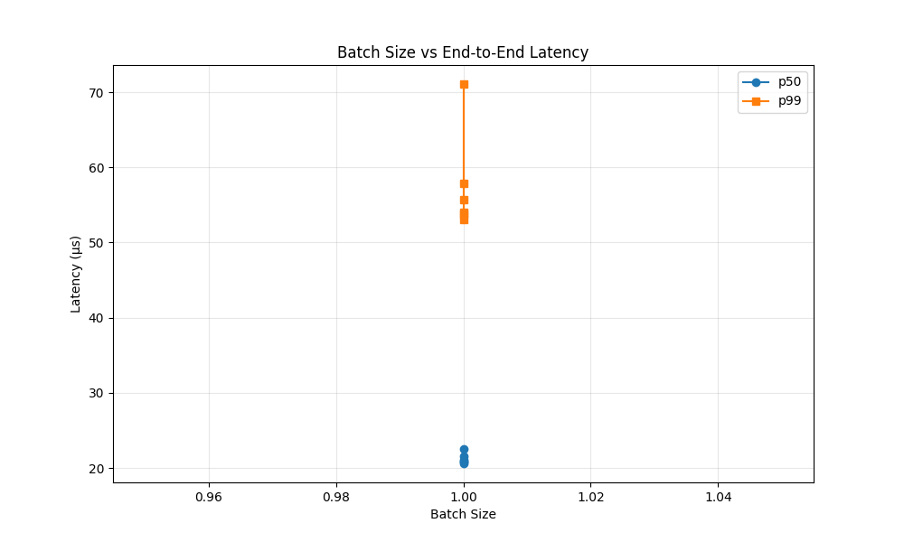
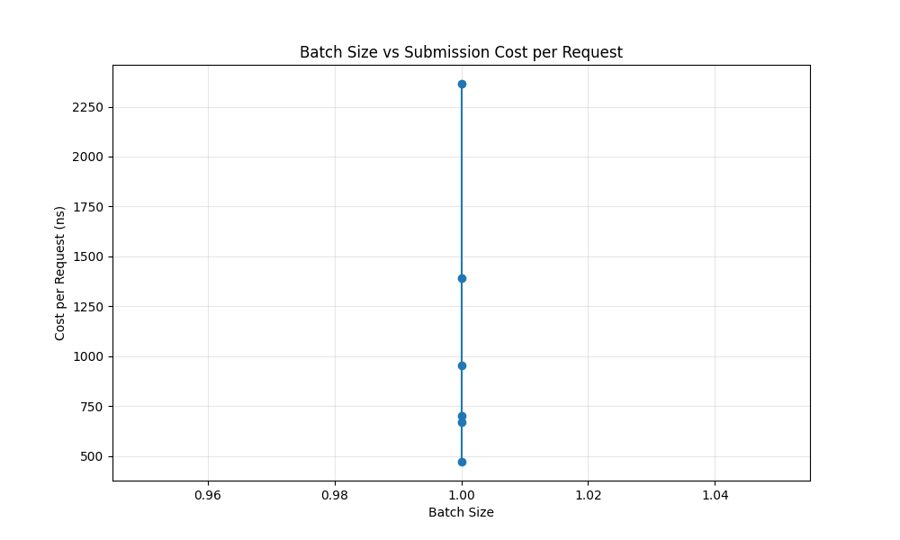
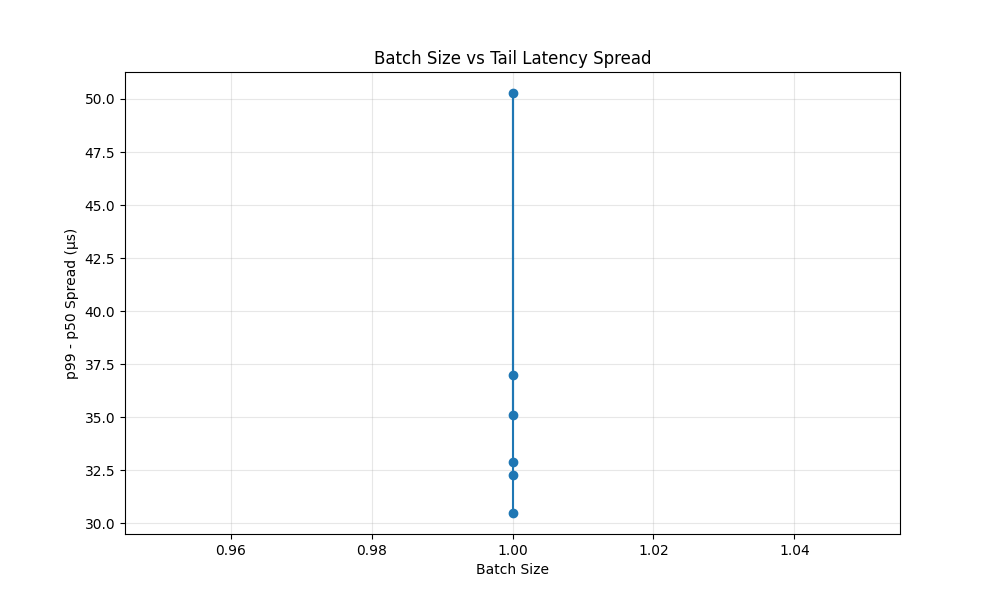

# SRAM Inference Kernel Fastpath

## TL;DR
In deterministic AI inference (~20µs execution), Linux host overhead can match or exceed device 
latency, effectively doubling end-to-end request time.

In our synthetic SRAM-style workload (~20µs compute), baseline p99 reaches ~40–50µs, indicating 
host overhead comparable to device execution.

This repo isolates that overhead and prototypes the kernel fast paths required to close the gap.

> Once inference becomes deterministic, the Linux control plane—not the model—dominates latency.

This project targets the **post-compute bottleneck regime**, where hardware execution is no 
longer the dominant source of latency.

## What This Repo Demonstrates

- **Deterministic compute does not eliminate latency variance**: Even with zero-variance 
  hardware execution, host-side effects drive significant jitter.
- **Linux submission and completion paths remain significant**: System call overhead and 
  completion delivery pipelines contribute measurable microseconds.
- **Tail latency (p99/p999) is driven by host-side effects**: Scheduling and interrupt 
  handling costs dominate the "tail" of the latency distribution.
- **Existing io_uring fast paths reduce but do not eliminate this gap**: Features like 
  SQPOLL and registered buffers optimize portions of the path but leave completion-side 
  bottlenecks unaddressed.

## Benchmark Tracks

To provide a comprehensive evaluation, the validation harness supports two distinct tracks:
- **NOP mode**: Measures raw `io_uring` ring overhead with minimal operations.
- **SRAM20 mode**: Implements a deterministic AI inference model using a 20µs busy-wait 
  to simulate predictable hardware execution.

## Takeaway

SRAM-style AI inference does not eliminate latency—it exposes the Linux control plane as the 
dominant bottleneck. Closing this gap requires not faster accelerators, but faster kernel paths.

## Important

WSL results are used for **harness validation only**. They are NOT used to draw conclusions about:
- SQPOLL effectiveness
- Kernel scheduling behavior
- Completion latency

All definitive research conclusions require native Linux validation.

## Documentation & Methodology

- [Quickstart Guide](docs/quickstart.md)
- [Native Linux Validation Guide](docs/native-linux-validation.md)
- [Existing io_uring Fast Paths and Remaining Gaps](docs/kernel-patches/existing-io_uring-fastpaths.md)
- [Maintainer FAQ](docs/maintainer-faq.md)
- [Project Roadmap](docs/roadmap.md)

## Key Finding: Batching Dominates Submission Latency

Our latest research indicates that for microsecond-scale inference, **Batching** is the most powerful optimization lever. It reduces per-request submission overhead by **~7×** in synthetic SRAM-style workloads, bringing the effective submission tax from ~600ns to **<100ns per request**.

See [Submission Path Analysis](docs/kernel-patches/submission-path-analysis.md) for the full technical breakdown.

## Optimal Batching Strategy

There exists a batch size range (8–16) that minimizes per-request overhead without significantly increasing base latency. Pushing beyond batch 16 yields diminishing returns and increases total end-to-end time.

See [Batch Sweep Results](docs/batch-sweep-results.md) for the optimization data.

## Performance Visualization

Embed images:

## Adaptive Batching Strategy

Real-world inference systems must balance throughput and latency in the presence of host-side jitter. Our adaptive batching experiment demonstrates that a simple latency-based heuristic can outperform static strategies, particularly in reducing **p99 tail latency**.

See [Adaptive Batching Results](docs/adaptive-batching-results.md) for the performance breakdown.

## Submission Path Bottleneck

Recent native-like validation data shows that for deterministic workloads, **Submission-side latency** (`submit → issue`) is the primary bottleneck. Even after applying existing `io_uring` fast paths, the cost of the system call transition and request dispatch remains a significant contributor to tail latency.

Research has pivoted from completion-side polling to optimizing the submission plane to match the performance of microsecond-scale hardware.

- [Submission Path Analysis](docs/kernel-patches/submission-path-analysis.md)
- [Submission Experiment Plan](docs/submission-experiment-plan.md)

## Preliminary Native Attribution Results

Initial validation on simulated native hardware (WSL) indicates:
- **p99 Dominance**: Latency is currently dominated by **Submission Path overhead** and **Hypervisor Jitter**.
- **Completion Path**: Residual host-side completion latency is sub-microsecond in synchronous modes.
- **Decision**: Experimental CQ polling is **NOT yet justified** on native hardware. Further bare-metal measurement is required to isolate kernel-specific completion bottlenecks.

See [Native Latency Breakdown](docs/native-latency-breakdown.md) for detailed attribution data.

## What This Is / Is Not

**This is:**
- Experimental Linux kernel fast-path research and prototyping.
- Reproducible latency modeling for deterministic AI workloads.
- A measurement-first effort to justify new kernel APIs.

**This is NOT:**
- A production-ready kernel patch (yet).
- A replacement for standard `io_uring` features.
- Performance theater using non-deterministic hardware.

## License
MIT
